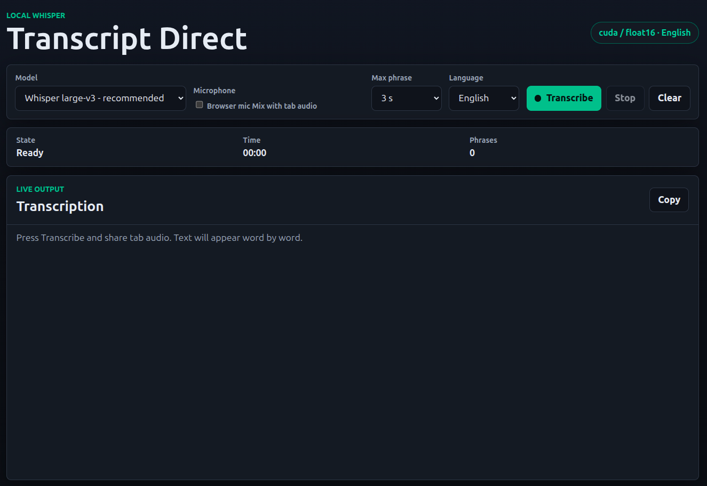

# Transcript Direct



Local web app for live audio transcription with `faster-whisper`. It has no
login: open the page, choose a model/language, and press `Transcribe`.

The app captures audio from a browser tab or screen. It can optionally mix the
browser microphone into the same audio signal before sending it to Whisper. The
output is grouped naturally: the backend emits a phrase when it detects a pause
and uses `Max phrase` only as a safety limit.

## Requirements

- Linux desktop, or Windows with WSL2.
- Python 3.10 or newer.
- Chrome/Chromium for tab/screen capture with audio.
- Internet access on first model use. `faster-whisper` downloads the selected
  model automatically into `models/whisper-cache/`.
- CUDA GPU recommended for `large-v3`. CPU works, but use `tiny` or `base` for
  practical latency. The app does not silently fall back from CUDA to CPU.
- Node.js is optional and only needed for the frontend syntax check.

## Quick Start

The launcher creates `.venv` and installs Python dependencies automatically if
they do not exist yet:

```bash
git clone <repo-url> transcript-direct
cd transcript-direct
./run-webapp.sh
```

Open the app in a real Chrome/Chromium tab:

```text
http://127.0.0.1:8099
```

For a CPU-only first run, start with the tiny model:

```bash
WHISPER_DEVICE=cpu WHISPER_MODEL_NAME=tiny ./run-webapp.sh
```

When you press `Transcribe` for the first time, the selected model is downloaded
automatically. The first run can take longer because of that download.

## CUDA Setup

`faster-whisper` uses CTranslate2. Current CTranslate2 wheels expect CUDA 12
runtime libraries such as `libcublas.so.12` and `libcudnn.so.9`. If your system
has a newer CUDA toolkit only, for example CUDA 13, the GPU may be visible but
transcription will fail until the CUDA 12 runtime libraries are available.

Install the CUDA runtime libraries inside the virtual environment:

```bash
source .venv/bin/activate
python -m pip install -r requirements-cuda.txt
```

Then restart the app with `./run-webapp.sh`. The launcher automatically adds
the NVIDIA package library directories from `.venv` to `LD_LIBRARY_PATH`.

If CUDA is selected but the required libraries are missing, the app reports
`CUDA missing libs` instead of falling back to CPU.

## Manual Installation

Use this if you prefer to manage the virtual environment yourself:

```bash
git clone <repo-url> transcript-direct
cd transcript-direct
python3 -m venv .venv
source .venv/bin/activate
python -m pip install --upgrade pip
python -m pip install -r requirements.txt
./run-webapp.sh
```

## Browser Access

Use `127.0.0.1` or `localhost` in a real Chrome/Chromium tab. Browser
tab/screen capture does not work reliably inside IDE previews or remote hosts
without HTTPS.

On Windows with WSL2, run the backend inside WSL and open the URL from a normal
Windows Chrome/Chromium tab. The browser captures Windows tab/screen audio and
microphone audio, then sends it to the WSL backend over `localhost`. If
`127.0.0.1` does not forward to WSL on your setup, keep using `localhost`;
opening the WSL IP directly over plain HTTP may block browser capture.

If the port is already in use:

```bash
PORT=8100 ./run-webapp.sh
```

If you use WSL2 and `127.0.0.1` does not forward to WSL on your setup, try:

```text
http://localhost:8099
```

## Usage

Recommended defaults:

- Model: `Whisper large-v3`.
- Source: browser tab or screen with audio.
- Language: `English`.
- Max phrase length: `3 s`.
- Cross-phrase context: `24` words.

Recommended CPU settings:

- Model: `Whisper tiny` for lowest latency, or `Whisper base` for better
  accuracy.
- Command: `WHISPER_DEVICE=cpu WHISPER_MODEL_NAME=tiny ./run-webapp.sh`

Normal flow:

1. Open `http://127.0.0.1:8099`.
2. Select model and language.
3. Enable `Include browser microphone` only if you want to mix your voice
   with the tab/screen audio.
4. Press `Transcribe`.
5. In the browser picker, choose a tab/screen and enable audio sharing.

## Models

The `models/` directory is committed only as an empty structure:

```text
models/
  .gitkeep
  whisper-cache/
    .gitkeep
```

Actual model files are ignored by Git. On first use, `faster-whisper` can
download models into `models/whisper-cache/`. To list additional local model
directories, set `TRANSCRIPT_MODEL_ROOTS`.

No manual model download is required for built-in models (`tiny`, `base`,
`small`, `large-v3`). The app lists them even when `models/whisper-cache/` is
empty, and downloads the selected one when transcription starts.

Useful environment variables:

```bash
WHISPER_MODEL_NAME=large-v3 ./run-webapp.sh
WHISPER_DEVICE=cpu ./run-webapp.sh
WHISPER_COMPUTE_TYPE=int8 ./run-webapp.sh
WHISPER_DOWNLOAD_ROOT=/path/to/cache ./run-webapp.sh
TRANSCRIPT_MODEL_ROOTS=/path/to/models ./run-webapp.sh
```

`WHISPER_COMPUTE_TYPE` defaults to `float16` on CUDA and `int8` on CPU unless
you set it manually.

## Tuning

```bash
TRANSCRIPT_PHRASE_SILENCE_SECONDS=0.55 ./run-webapp.sh
TRANSCRIPT_PARAGRAPH_SILENCE_SECONDS=1.2 ./run-webapp.sh
TRANSCRIPT_SPEECH_RMS_THRESHOLD=0.0025 ./run-webapp.sh
TRANSCRIPT_ADAPTIVE_RMS_MULTIPLIER=3.0 ./run-webapp.sh
WHISPER_BEAM_SIZE=5 ./run-webapp.sh
WHISPER_CONTEXT_WORDS=24 ./run-webapp.sh
```

For maximum speed, lower `WHISPER_BEAM_SIZE=1`. For better continuity, the
default uses `WHISPER_CONTEXT_WORDS=24`. If difficult audio causes repetition,
try `WHISPER_CONTEXT_WORDS=0`.

## Quick Tests

Python syntax check:

```bash
python -m compileall backend scripts
```

Frontend syntax check:

```bash
node --check frontend/static/app.js
```

Endpoint checks with the app running:

```bash
./run-webapp.sh
curl -s http://127.0.0.1:8099/api/health
curl -s http://127.0.0.1:8099/api/models
```

In another terminal, verify the port is listening:

```bash
ss -ltnp 'sport = :8099'
```

CPU mode smoke test:

```bash
PORT=8101 WHISPER_DEVICE=cpu WHISPER_MODEL_NAME=tiny ./run-webapp.sh
curl -s http://127.0.0.1:8101/api/health
```

Expected health fields include:

```json
{"device":"cpu","compute_type":"int8"}
```

## Accuracy Benchmark

Install extra benchmark dependencies:

```bash
python -m pip install -r benchmark-requirements.txt
```

Download and materialize the two-speaker AMI dataset into `benchmark_data/`:

```bash
python scripts/download_benchmark_dataset.py
```

Run the recommended benchmark:

```bash
python scripts/benchmark_asr.py --model large-v3 --limit 10
```

CPU benchmark smoke test:

```bash
WHISPER_DEVICE=cpu WHISPER_COMPUTE_TYPE=int8 python scripts/benchmark_asr.py --model tiny --limit 1 --configs live-3s-beam5
```

Full run:

```bash
python scripts/benchmark_asr.py --model large-v3 --limit 50 --configs live-3s-context24,live-3s-beam5
```

The dataset is written to `benchmark_data/ami_2speaker_test/` and results are
written to `benchmark_results/`. Both directories are ignored by Git.

Local reference result with `large-v3`, CUDA/float16, and 10 clips:

| Config | WER | Bag F1 | RTF | Chunk latency |
| --- | ---: | ---: | ---: | ---: |
| live-3s-beam5 | 0.261 | 0.828 | 0.053 | 0.155s |
| live-3s-context24 | 0.240 | 0.845 | 0.050 | 0.146s |
| live-2s-beam5 | 0.273 | 0.815 | 0.068 | 0.134s |
| live-1s-beam5 | 0.388 | 0.719 | 0.102 | 0.103s |

On a full 50-clip run, `live-3s-context24` reduced WER from `0.294` to `0.277`
compared with `live-3s-beam5`.
